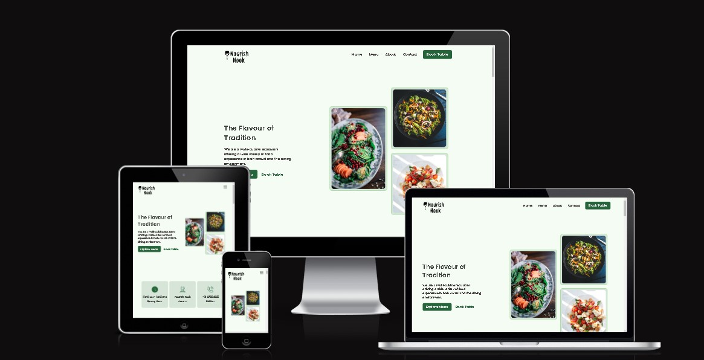

# **Nourish-Nook**
live Preview: [Click Me](https://nourish-nook.netlify.app)

 [here](https://megit.com/careers)

## Project Goals
The idea for this project has always been something that I would like to see more when searching for a restaurant in my neighbourhood. From having a background in food, whenever I try and look for healthier dishes, some sites just bombard you with any menu items unless one commit to a longer distance to look for a better place. I wanted to make a website that is clean, appealing to the eye and straight forward to what the person is looking for.

A restaurant website developed to display the restaurant menu and to show additional restaurant information. The 

### New User Stories

1. I want the website to be intuitive, so I can get an impression of what it does from first glance.
2. I want the website to be visually appealing and well presented so that I will enjoy browsing for longer.
1. I want to be able to view the website on my mobile, tablet or desktop device.
2. I want the menu itemes to be categorised in breakfast, lunch and dinner, so I can quickly choose the category and order without delay.
3. As a user I want to be able to read reviews and hear what other customers think about the restaurant.
6. As a user I want to be able to contact the site owner so that I can ask any questions or offer recommendations that I may have.
7. As a user I want to be able to view the site owners social media pages so that I can see what else they are doing.

## Target Audience
People who enjoy dining out and those who in essence are they lazy type and like healthy dishes. 

## Features
The Features within this website are common to all users of the internet. This being in the form of menu/navigation bar and footer. Having a familiar layout that all internet users have experienced, makes the website have a better User experience. From the initial viewing on the home page, people are drawn to the 'normal' areas where they would expect certain placements to be.

## Interaction Design 

User interactions will be intuitive and consistent throughout the site to ensure it is easy to use and quick to learn for the user. Clickable links and buttons will have a hover effect applied so they are easily identifiable when a user hovers over them.

## Information Design 

Will allow for the prioritisation of the information to be displayed in a clear and concise manner to make it as easy as possible for the user to read and quickly find the information that is most relevant to their needs.

## Technologies Used
- HTML5 - basic coding to build a website
- CSS3 - used for styling the website
- Gitpod - used to create the website
- Github - used to store repository of website and deploy website
- Chrome Dev Tools - used to view and experiment with styles
- Font Awsome - used to find the icons 
- Google Fonts - used to find the fonts for the website
- Pexels - provided the images seen throughout the website
- Ui.dev - created a multi image display of webpage on multiple devices
- Eye Dropper - Chrome add on that allowed me to pick the exact color I was after
- Canva - Color pairing tool that showed me which colors went well with the ones i chose

## Testing and Bugs
Click to [here](TESTING.md) to see further information on testing

- __Further Testing__
    - The site was tested on google chrome, edge and safari browsers.
    - The site was viewed on multiple devices such as desktop (including an ultra wide monitor), iphone, ipad, ipad mini, and laptop. 
    - All links were checked extensively to make sure they direct the user to the correct location.
    - The form was tested multiple times with various inputs all resulting in a successful submit.

## Deployment

### Github Deployment
The website was delpoyed using GitHub. To do this I did the following;
1. When on the websites GitHub repository, click on the settings tab
2. Now on the settings page, on the left hand side of the page, click on the pages tab
3. Under the Source section, click on the drop down menu titled Branch and select main
4. The page is now published with a link available to use.

### Creating a Fork or Copying
To clone/fork/copy the repository you click on the fork tab which is situated next to unwatch tab in the top right corner of the page

### Clone
To create a clone you do the following;
1. Click on the code tab, left of the Gitpod tab
2. To the right of the repository name, click the clipboard icon
3. In the IED open GitBash
4. Change the working directory to the location you prefer
5. Add Git Clone with the copy of the repositroy name
6. Clone has been created

## Credits

### Content
- The text throughout the website was taken from [Google Fonts](https://fonts.google.com/)
- The icons in the footer were taken from [Font Awsome](https://fontawesome.com/)

### Media
- The image on the home screen came from [Pexels](https://www.pexels.com/)
- The images on the Home and Gallery pages were taken from [Pexels](https://www.pexels.com/)
- The links used in the weekly recipes are from [BBC-GoodFood] (https://www.bbcgoodfood.com/)
- The icons in the footer are linked to their relevant icon, Facebook, Instagram, Github and Linkedin
- Many issues were resolved using [W3School](https://www.w3schools.com/)

